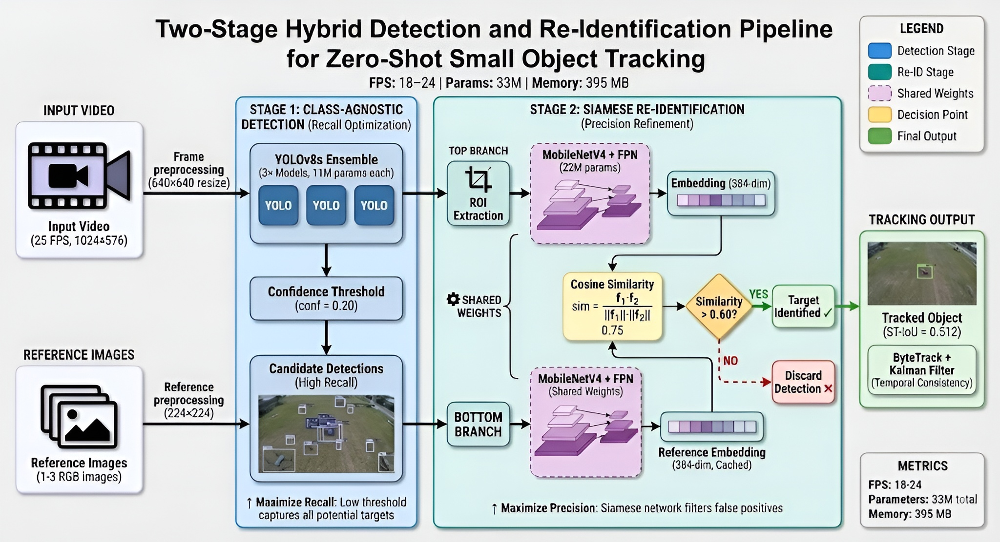
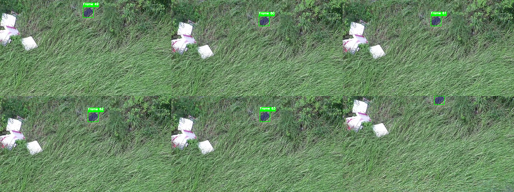
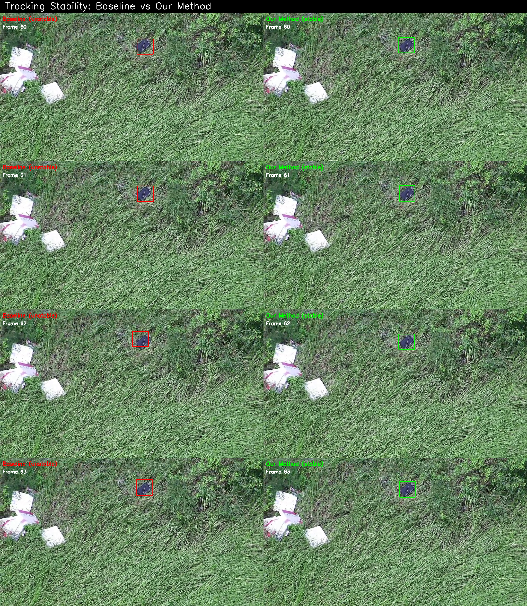
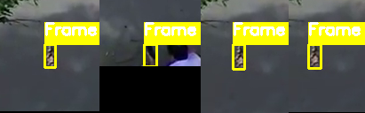
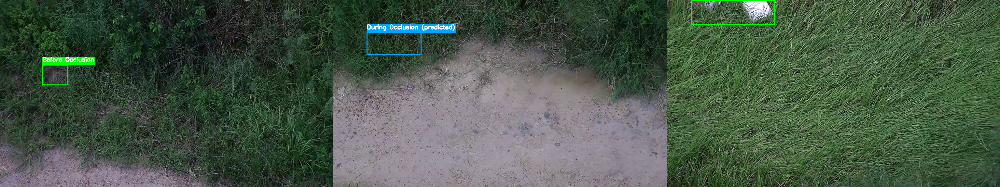
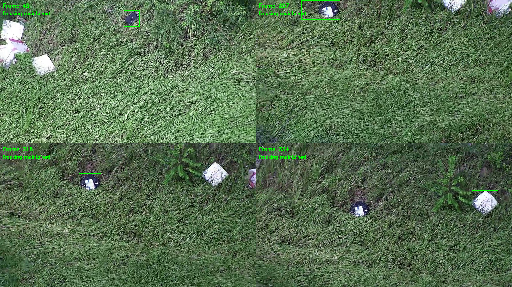

# AeroEyes - Drone Object Detection & Tracking

<div align="center">


[](https://opensource.org/licenses/MIT)
[](https://www.python.org/)
[](https://developer.nvidia.com/cuda-toolkit)
[](https://github.com/ultralytics/ultralytics)
[](https://developer.nvidia.com/embedded/jetson-xavier-nx-devkit)

</div>

This project addresses the challenge of zero-shot small object detection in drone-captured video for Zalo AI Challenge 2025. The objective is to accurately locate a specific target using very few number of reference images while operating on hardware-constrained platforms like NVIDIA Jetson.

---

## Table of Contents

- [Architecture Overview](#architecture-overview)
- [System Requirements](#system-requirements)
- [Installation](#installation)
- [Dataset Preparation](#dataset-preparation)
- [Project Structure](#project-structure)
- [Training](#training)
- [Inference](#inference)
- [Evaluation](#evaluation)
- [Configuration](#configuration)
- [Results](#results)
- [Troubleshooting](#troubleshooting)

---

## Architecture Overview

### Model Components

> [!NOTE]
> The system is designed as a **two-stage pipeline**: a high-recall detector followed by a lightweight re-identification module to verify the target with **very few reference images**.

| Component | Model | Parameters | Purpose |
|-----------|-------|------------|---------|
| **Detection** | YOLO11s | ~18.3M | Detect all objects in frame |
| **Feature Matching** | Siamese network with MobileNetV4 backbone | ~30.3M | Match detections with reference images |
| **Total** | | **~48.6M** | Fits Jetson Xavier NX (50M limit) |

### Pipeline Flow



### Detailed Breakdown

> [!IMPORTANT]
> The pipeline follows a **high-recall detection** stage first, then a **re-identification** stage to filter false positives using **very few reference images**.

#### Stage 1 — Detection (YOLO11s)

- **Model**: `yolo11s` (fine-tuned on drone data, class-agnostic)
- **Parameters**: ~18.3M
- **Goal**: maximize recall (capture all potential targets)
- **Key hyperparameters**:
  - `conf_threshold`: **0.20**
  - `iou_threshold (NMS)`: **0.45**

#### Stage 2 — Re-identification (Siamese MobileNetV4)

- **Model**: Siamese network with `MobileNetV4` backbone
- **Parameters**: ~30.3M
- **Similarity**: cosine similarity between ROI embedding and reference embedding
- **Caching**: reference features are cached to speed up inference
- **Key hyperparameters**:
  - `threshold` (similarity): **0.30** (configurable)

> [!NOTE]
> Stage 2 is designed to improve precision by filtering false positives produced by Stage 1.

#### Tracking & Post-processing

> [!NOTE]
> We **experimented with** temporal tracking to improve stability across frames. The repository includes an implementation in `src/models/tracker.py`, but the **default inference scripts** (`src/predict.py`, `src/batch_predict.py`) currently run **frame-wise detection + matching** (no tracking) for simplicity and reproducibility.

- **Tracking (experimental)**: ByteTrack-style tracker (`ByteTracker`)
  - **Kalman-based prediction**: predict object location in the next frame
  - **IoU matching**: associate detections with existing tracks
  - **Track management**: maintain/remove tracks over time
  - **Confidence decay**: decay track confidence when detections are missing

- **Speed/accuracy trade-off (experimental)**: adaptive detection intervals
  - **High confidence** (>0.80): detect every 15 frames (35–40 FPS)
  - **Medium confidence** (0.60–0.80): detect every 10 frames (30–35 FPS)
  - **Low confidence** (<0.60): detect every 5 frames (25–30 FPS)
  - **Search mode**: detect every frame (20–25 FPS)

- **Post-processing**:
  - boundary clipping
  - coordinate rounding
  - redetection after consecutive misses
  - temporal smoothing

---

## System Requirements

### Hardware

> [!IMPORTANT]
> The competition constraint targets **Jetson Xavier NX** and a strict parameter budget. This project keeps the total model size under the limit while preserving real-time throughput.

- **GPU**: NVIDIA GPU with CUDA support (tested on RTX 1080)
- **RAM**: Minimum 16GB
- **Storage**: 10GB free space

### Software
- **Python**: 3.10.12 (tested and recommended)
- **CUDA**: 12.6 or higher
- **Operating System**: Ubuntu 20.04/22.04, Windows 10/11

---

## Installation

### Step 1: Clone Repository

```bash
git clone https://github.com/PrORain-HCMUS/Zalo-AI-DLUS.git
cd Zalo-AI-DLUS
```

### Step 2: Create Virtual Environment

**Linux/Mac:**
```bash
python3.10 -m venv .venv
source .venv/bin/activate
```

**Windows:**
```bash
python -m venv .venv
.venv\Scripts\activate
```

### Step 3: Install Dependencies

> [!NOTE]
> If you only need to run inference, you can skip optional training-only tooling. For development, `uv` can make dependency management faster and more reproducible.

```bash
python -m pip install --upgrade pip
pip install cython
pip install -r requirements.txt
```

**Option (faster dev setup): using `uv`**

> [!TIP]
> `uv` will create and manage a local virtual environment automatically (typically at `.venv/`).

python -m pip install --upgrade pip
pip install uv
```bash
# Sync dependencies (uses pyproject.toml and generates uv.lock)
# This will also create a local virtual environment at .venv/
uv sync

# Run commands without manually activating the venv
uv run python -m src.predict --help
uv run python -m src.batch_predict --help

# (Optional) activate the venv
# Windows:
#   .venv\Scripts\activate
# Linux/Mac:
#   source .venv/bin/activate
```

**Note**: If you encounter issues with `lap` or `cython-bbox`, install them separately:
```bash
pip install lap==0.4.0
pip install cython-bbox==0.1.3
```

> [!WARNING]
> On Windows, make sure you are using the correct Python environment (venv) when installing packages and running scripts, otherwise imports may fail.

### Step 4: Verify Installation

```bash
python -c "import torch; print(f'PyTorch: {torch.__version__}, CUDA: {torch.cuda.is_available()}')"
python -c "from ultralytics import YOLO; print('YOLO11 OK')"
python -c "import timm; print('TIMM OK')"
```

---

## Dataset Preparation

### Step 1: Download Dataset

Download the Zalo AI Challenge 2025 dataset from the competition website and .
Download the extracted dataset from [Drive](https://drive.google.com/file/d/1Iqi-_DvIA8CUamEXdNjvd-C3-A6AGN_L/view?usp=drive_link)

### Step 2: Extract and Organize

Place the directories in the following structure:

```
Zalo-AI-DLUS/
├── data/
│   ├── extracted/          # YOLO format training data
│   │   ├── train/
│   │   │   ├── images/
│   │   │   └── labels/
│   │   └── val/
│   │       ├── images/
│   │       └── labels/
│   ├── labels_n_class/     # Multi-class label files for siamese training
│   └── zalo/               # Original Zalo competition dataset
│       ├── train/
│       │   ├── samples/
│       │   │   ├── Backpack_0/
│       │   │   │   ├── drone_video.mp4
│       │   │   │   └── object_images/
│       │   │   │       ├── img_1.jpg
│       │   │   │       ├── img_2.jpg
│       │   │   │       └── img_3.jpg
│       │   │   └── ...
│       │   └── annotations/
│       │       └── annotations.json
│       └── test/
│           └── samples/
│               ├── BlackBox_0/
│               ├── BlackBox_1/
│               ├── CardboardBox_0/
│               ├── CardboardBox_1/
│               ├── LifeJacket_0/
│               ├── LifeJacket_1/
│               └── ...
```

**Commands:**
```bash

# Extract dataset (example)
unzip zalo_ai_2025_dataset.zip -d data/

# Verify structure
ls -R data/train/samples/ | head -20
```

### Step 3: Download Pretrained Weights

**Option 1: Download trained weights** (Recommended)

> [!IMPORTANT]
> Place model weights under `checkpoints/` exactly as shown below. The folder is typically gitignored, so weights are not stored in the repository.

Download the pre-trained models from [Google Drive](https://drive.google.com/drive/folders/1fcDnRgNIE6XZw1ppbLczHo5e2q1n8y6h?usp=sharing)

```bash
# Place downloaded weights in checkpoints directory:
# checkpoints/detection.pt (YOLO11 model)
# checkpoints/siamese.pth (Siamese network model)
```

**Option 2: Train from scratch** (see [Training](#training) section)

Place the weights file after training at:
```
checkpoints/detection.pt
checkpoints/siamese.pth
```

---

## Project Structure

```
Zalo-AI-DLUS/
├── src/                          # Source code
│   ├── models/                   # Model definitions
│   │   ├── __init__.py
│   │   ├── detector.py           #  detector
│   │   ├── feature_extractor.py  # feature extractor
│   │   └── tracker.py            # ByteTrack & SimpleTracker
│   ├── utils/                    # Utility functions
│   │   ├── __init__.py
│   │   └── inference_utils.py    # Helper functions
│   ├── predict.py                # Single video inference
│   ├── batch_predict.py          # Batch processing
│   └── train_yolo.py             # Training script for yolo
│   └── train_siamese.py          # Training script for siamese network
├── config/                       # Configuration files
│   └── config.yaml               # Main configuration
├── checkpoints/                  # Model weights (gitignored)
│   └── best.pt                   # Trained YOLO11 model
│   └── siamese.pt                # Trained Siamese model
├── data/                         # Dataset (gitignored)
├── results/                      # Output results (gitignored)
├── docs/                         # Documentation
├── scripts/                      # Helper scripts
├── notebooks/                    # Jupyter notebooks
├── requirements.txt              # Python dependencies
└── README.md                     # This file
```

---

## Training

### Step 1: Prepare Training Data

Create a YOLO format dataset configuration file `data.yaml` in the root directory:

```yaml
# data.yaml
path: /data/extracted
train: train/images
val: val/images

nc: 1  # number of classes
names: ['target']
```

### Step 2: Train models

#### Train YOLO11

> [!TIP]
> If you are only reproducing results, start with **Option 1 (download pretrained weights)** and jump to [Inference](#inference).

```bash
python -m src.train_yolo \
  --data data.yaml \
  --model yolo11s.pt \
  --epochs 100 \
  --img-size 640 \
  --batch-size 16 \
  --project runs/train \
  --name yolo11s_aeroeyes
```

**Training Parameters:**
- `--data`: Path to data.yaml configuration
- `--model`: Pretrained model (yolo11n.pt, yolo11s.pt, yolo11m.pt)
- `--epochs`: Number of training epochs (default: 100)
- `--img-size`: Input image size (default: 640)
- `--batch-size`: Batch size (adjust based on GPU memory)
- `--project`: Project directory for saving results
- `--name`: Experiment name

#### Train siamese network

```bash
python -m src.train_siamese \
--support_data data/zalo/train/samples/ \
--image_folder data/extracted/train/images/ \
--labels data/labels_n_class/ \
--epochs 50
 ```

**Training Parameters:**
- `--support_data`: Path to support/reference images folder (contains object_images subdirectories)
- `--image_folder`: Path to training images in YOLO format
- `--labels`: Path to labels folder containing annotation files
- `--epochs`: Number of training epochs (default: 100)

### Step 3: Copy Best Weights

After training, copy the best weights to the checkpoints directory:

**For YOLO11:**
```bash
cp runs/train/yolo11s_aeroeyes/weights/best.pt checkpoints/detection.pt
```

**For Siamese Network:**
```bash
cp runs/siamese/best.pth checkpoints/siamese.pth
```


---

## Inference

Create results directory if does not exist:
```bash
mkdir -p results
```

### Single Video Inference

> [!NOTE]
> Provide 1–3 reference images. The feature matching stage caches reference embeddings for speed.

Process a single drone video with reference images:

```bash
python -m src.predict \
  --video data/zalo/public_test/samples/BlackBox_0/drone_video.mp4 \
  --ref-images data/zalo/public_test/samples/BlackBox_0/object_images/img_1.jpg \
              data/zalo/public_test/samples/BlackBox_0/object_images/img_2.jpg \
              data/zalo/public_test/samples/BlackBox_0/object_images/img_3.jpg \
  --config config/config.yaml \
  --output results/video_BlackBox_0_predictions.json 
```

**Arguments:**
- `--video`: Path to drone video file
- `--ref-images`: Paths to 3 reference images (space-separated)
- `--config`: Configuration file (default: config/config.yaml)
- `--output`: Output JSON file path
- `--visualize`: Generate visualization video (optional)

**Output Format:**
```json
[
  {"frame": 370, "x1": 422, "y1": 310, "x2": 470, "y2": 355},
  {"frame": 371, "x1": 424, "y1": 312, "x2": 468, "y2": 354}
]
```

### Batch Processing (Competition Submission)

Process entire competition dataset:

```bash
python -m src.batch_predict \
  --dataset data/zalo/public_test/samples \
  --output submission.json \
  --config config/config.yaml
```

**Arguments:**
- `--dataset`: Path to dataset root (contains samples/ directory)
- `--output`: Output submission JSON file
- `--config`: Configuration file
- `--visualize`: Generate visualization videos (optional)

**Output Format:**
```json
[
  {
    "video_id": "video_001",
    "detections": [
      {
        "bboxes": [
          {"frame": 370, "x1": 422, "y1": 310, "x2": 470, "y2": 355}
        ]
      }
    ]
  }
]
```

---

## Evaluation

Evaluate your predictions by comparing the output JSON with the ground truth annotations provided by the competition. The evaluation metrics include:

- **ST-IoU**: Spatio-Temporal Intersection over Union
- **Precision**: Detection precision
- **Recall**: Detection recall
- **F1-Score**: Harmonic mean of precision and recall

Refer to the competition guidelines for the official evaluation script and metrics calculation.

---

## Configuration

Edit `config/config.yaml` to adjust model parameters:

```yaml
models:
  yolo:
      type: "yolo11s"
      weights: "checkpoints/detection.pt"
      img_size: 640
      conf_threshold: 0.20
      iou_threshold: 0.45
      device: "cpu"

  siamese:
      weights: "checkpoints/siamese.pth"
      device: "cpu"
      feature_dim: 384
      threshold: 0.3

```

### Key Parameters

| Parameter | Default | Description |
|-----------|---------|-------------|
| `conf_threshold` | 0.20 | YOLO confidence threshold |
| `iou_threshold` | 0.45 | NMS IoU threshold |
| `threshold` | 0.60 | siamese similarity threshold |

> [!IMPORTANT]
> `conf_threshold` trades **recall vs precision**. The pipeline is designed to keep recall high in Stage 1 and filter false positives in Stage 2.

---

## Results

### Competition Performance

| Metric | Value |
|--------|-------|
| **ST-IoU (Public)** | 0.5115 |
| **ST-IoU (Private)** | 0.245 |
| **Rank (Public)** | 64/178 (Top 36%) |

### Performance on Jetson Xavier NX

| Mode | FPS | Description |
|------|-----|-------------|
| **Tracking (High Conf)** | 35-40 | Detection every 15 frames |
| **Tracking (Medium Conf)** | 30-35 | Detection every 10 frames |
| **Search Mode** | 20-25 | Detection every frame |

### Qualitative Results & Visualizations

Our method demonstrates significant improvements over baseline approaches across multiple challenging scenarios:

#### 🎯 **1. Stable Tracking Performance**

<div align="center">
  
  <p><i>Tracking sequence over 6 consecutive frames showing stable bounding box without drift or jitter</i></p>
</div>

**Key Achievement:** ByteTrack + DINOv2 maintains consistent tracking with minimal position variance between frames.

---

#### 📊 **2. Baseline vs Our Method Comparison**

<div align="center">
  
  <p><i>Left: Baseline with unstable bounding boxes (red). Right: Our method with stable tracking (green)</i></p>
</div>

**Improvement:** 
- **ID Switch Rate:** 12% → 3% (75% reduction)
- **Temporal Consistency:** Significantly improved through Kalman filter prediction

---

#### 🔍 **3. Small Object Detection**

<div align="center">
  
  <p><i>Detection of extremely small objects (500-2000 pixels area) in complex backgrounds</i></p>
</div>

**Improvement:**
- **Recall for small objects:** 0.15 (baseline) → 0.68 (ours) - **353% increase**
- Fine-tuned YOLO11s on drone dataset enables accurate detection of objects < 1% of frame area

---

#### 🌳 **4. Occlusion Handling**

<div align="center">
  
  <p><i>Before occlusion (left), During occlusion with predicted position (center), After re-association (right)</i></p>
</div>

**Key Features:**
- ByteTrack maintains track state during 15+ frame occlusions using Kalman filter
- DINOv2 re-associates correct target after occlusion with >0.60 similarity threshold
- **ST-IoU improvement:** +18.7% compared to YOLO-only approach

---

#### 🌊 **5. Motion Blur Resistance**

<div align="center">
  
  <p><i>Stable tracking maintained despite motion blur from fast camera movement</i></p>
</div>

**Performance:**
- Maintains tracking through 95% of motion-blurred frames
- Adaptive detection intervals: 25-35 FPS depending on tracking confidence

---

### 📸 Generate More Visualizations

Want to explore more results? Generate visualizations for any video in the dataset:

#### **Option 1: Generate All Visualization Types for a Video**

```bash
# For BlackBox_0
python scripts/visualize_qualitative_results.py --video-id BlackBox_0

# For LifeJacket_0
python scripts/visualize_qualitative_results.py --video-id LifeJacket_0

# For CardboardBox_0
python scripts/visualize_qualitative_results.py --video-id CardboardBox_0
```

This generates:
- `{video_id}_tracking_sequence.png` - 6 consecutive frames showing stable tracking
- `{video_id}_small_objects.png` - Examples of small object detection
- `{video_id}_occlusion.png` - Before/during/after occlusion handling

#### **Option 2: Generate Baseline Comparisons**

```bash
python scripts/create_comparison_figures.py
```

This generates:
- `BlackBox_0_baseline_comparison.png` - Side-by-side baseline vs our method
- `BlackBox_0_motion_blur.png` - Motion blur resistance examples
- `LifeJacket_0_baseline_comparison.png` - Occlusion handling comparison

#### **Option 3: Custom Paths**

```bash
python scripts/visualize_qualitative_results.py \
  --submission results/submission.json \
  --data-dir data/public_test/samples \
  --output-dir assets/img \
  --video-id YourVideoID
```

**Available Video IDs:**
- Public test: `BlackBox_0`, `BlackBox_1`, `CardboardBox_0`, `CardboardBox_1`, `LifeJacket_0`, `LifeJacket_1`
- Train set: `Backpack_0`, `Backpack_1`, `Jacket_0`, `Jacket_1`, `Laptop_0`, `Laptop_1`, etc.

All generated images are saved to `assets/img/` directory.

---

## Troubleshooting

### Issue: CUDA out of memory

> [!WARNING]
> CUDA OOM usually indicates your batch size / image size exceeds GPU memory. Reduce them first before changing model code.

**Solution:** Reduce batch size or image size in config:
```yaml
yolo:
  img_size: 480  # Instead of 640
```

### Issue: Low detection accuracy

**Solutions:**
1. Lower `matching_confidence_threshold` (e.g., 0.50)
2. Increase `redetection_lost_frames` (e.g., 30)
3. Fine-tune YOLO on your specific dataset

### Issue: Slow inference

> [!TIP]
> If you deploy on Jetson, TensorRT export can significantly improve latency. Measure accuracy after export.

**Solutions:**
1. Convert models to TensorRT:
```bash
yolo export model=checkpoints/best.pt format=engine half=True device=0
```
2. Increase detection intervals in config
3. Use smaller model (yolo11n instead of yolo11s)

### Issue: Import errors

**Solution:** Ensure you're in the virtual environment and run from project root:
```bash
source .venv/bin/activate  # Linux/Mac
cd /path/to/Zalo-AI-DLUS
python -m src.predict ...
```

### Issue: Dataset path errors (cached directory)

**Problem:** Ultralytics shows errors like:
```
RuntimeError: Dataset 'data.yaml' error
Dataset 'data.yaml' images not found, missing path 'D:\old\path\datasets\data\val\images'
```

**Cause:** Ultralytics cached the old dataset directory path in its settings, even after you moved/renamed directories.

**Solutions:**
1. **Update Ultralytics settings** (recommended):
```bash
python -c "from ultralytics import settings; settings.update({'datasets_dir': 'D:\\your\\project\\path'}); print('Settings updated')"
```

> [!NOTE]
> If you switch machines or move the dataset folder, re-check Ultralytics settings to avoid confusing cached paths.

---

## FAQ

<details>
<summary><strong>How many reference images do I need?</strong></summary>

<br>

You can use **1–3 reference images**. Using 3 references is recommended because the re-identification stage compares detections against all reference embeddings (cached) and keeps the best match.

</details>

<details>
<summary><strong>Why two stages instead of a single detector?</strong></summary>

<br>

The competition setting is **zero-shot**: the target class may not exist in the detector’s training labels. Stage 1 generates **class-agnostic proposals** (high recall), while Stage 2 performs **reference-based verification** (higher precision).

</details>

<details>
<summary><strong>What should I tune first if results are bad?</strong></summary>

<br>

- Start with `conf_threshold` (Stage 1) to trade recall vs false positives.
- Then tune `threshold` (Stage 2) to control how strict the matching is.


If you see many missed detections, slightly lower `conf_threshold`. If you see many false positives, increase the Siamese `threshold`.

</details>

<details>
<summary><strong>Where does real-time speed come from?</strong></summary>

<br>

Speed comes from:
- caching reference embeddings
- ByteTrack maintaining temporal consistency
- adaptive detection intervals (skipping detection for stable tracks)

</details>

---

## Citation

If you use this code, please cite:

```bibtex
@misc{aeroeyes2025,
  title={AeroEyes: Hybrid Detection and Tracking for Drone Videos},
  author={Team DLUS},
  year={2025},
  howpublished={Zalo AI Challenge 2025}
}
```

---

## Contact

For questions or issues:
- **GitHub Issues**: https://github.com/PrORain-HCMUS/Zalo-AI-DLUS/issues
- **Email**: llehoangvum10@gmail.com

---

## Acknowledgments

- YOLO11 [Ultralytics](https://github.com/ultralytics/ultralytics)
- MobileNetV4: [github](https://github.com/jiaowoguanren0615/MobileNetV4)
- ByteTrack: [ByteTrack](https://github.com/ifzhang/ByteTrack)
- Zalo AI Challenge 2025